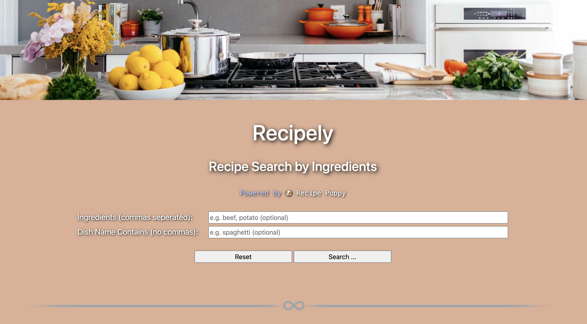
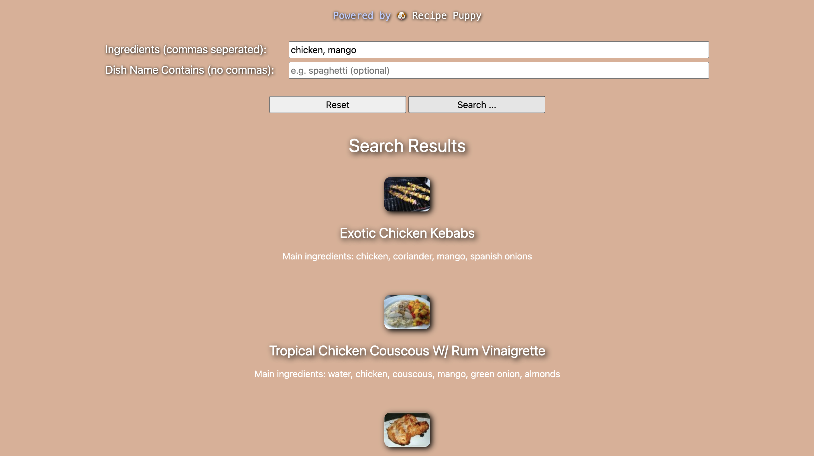

# Recipely

## Project Objective
Design and develop a webpage to get recipes on demand when queried by dish or the ingredients.

## API
We power our RESTful web service using the Recipe Puppy API. This api lets you search through recipe puppy database of over a million recipes by keyword and/or by search query.

Link: http://www.recipepuppy.com/about/api/

## Technologies Used:

- HTML
- CSS
- Bootstrap
- JavaScript
- Ajax

## Sample Output

## Accomplishments

